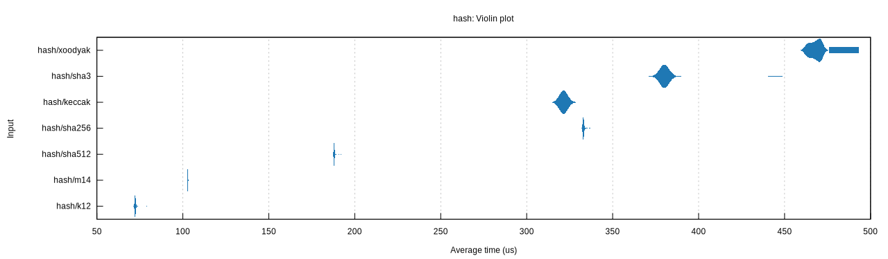
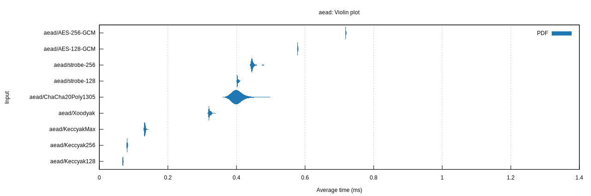

# cyclist

A Rust implementation of the Cyclist mode of permutation-based cryptography.

Includes Xoodyak and several Keccak-_p_ based constructions.

## Benchmarks

All produced on my M1 Air.
Comparisons here are to fairly generic 64-bit implementations, no bitslicing or vectorization.

### Permutations

### Hashing (100KiB Input)

Hashing 100KiB blocks:

### Authenticated Encryption (100KiB Input)

